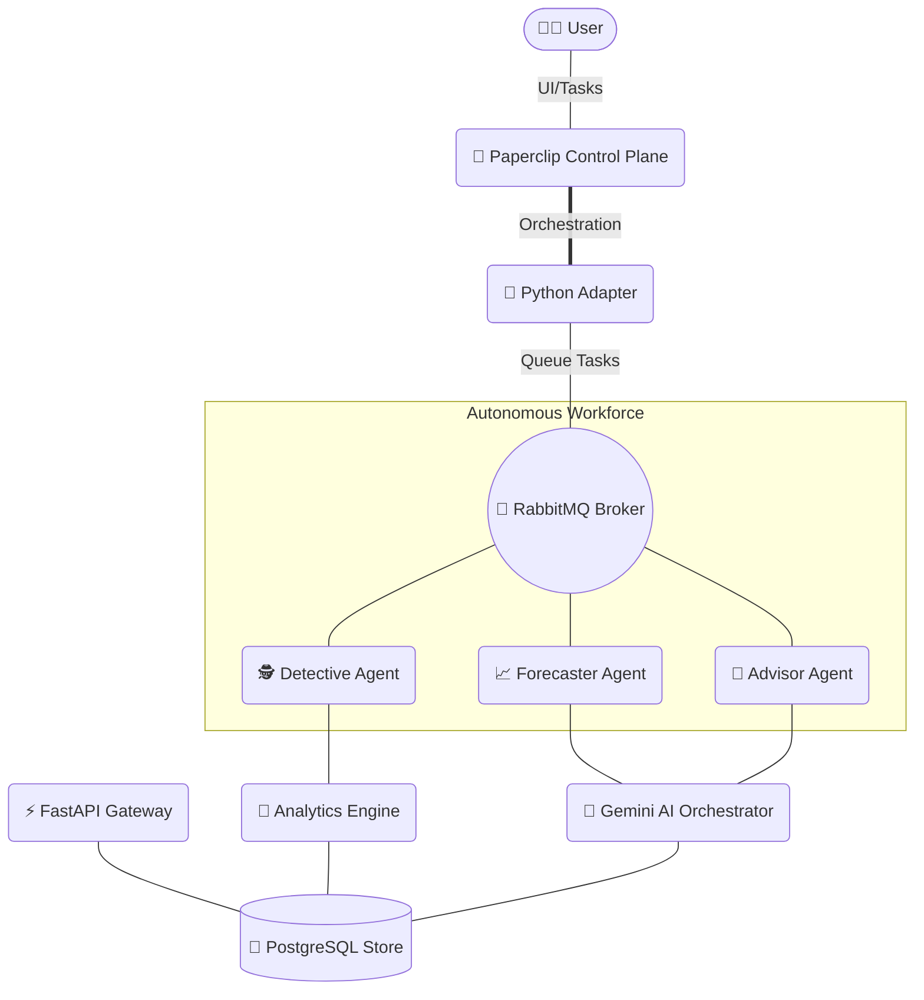

<div align="center">
  
  
  
  
  
  
  
  <br />
  <h1>🚀 AI Financial Analyst Platform</h1>
  <p>An enterprise-grade, microservice-based AI platform providing predictive analytics, real-time market data, and automated financial insights.</p>
</div>

<br />

## 🌟 Executive Summary

This platform is a comprehensive **AI Financial Analyst** designed for scale and resilience. Utilizing a microservices architecture bridged by RabbitMQ and powered by advanced **Gemini AI** capabilities, the system ingests, processes, and generates deep financial intelligence. The seamless, fluid frontend is built with **Next.js 16**, ensuring a world-class enterprise user experience.

---

## 🏗️ Architecture

The system is decoupled into specialized microservices, with **Paperclip v0.3.1** serving as the high-level orchestration control plane for governance and budget management.



---

## ✨ Key Capabilities

🚀 **Autonomous Workforce:** Multi-agent collaboration (Detective, Forecaster, Advisor) with native budget caps and heartbeat monitoring.  
📉 **Shadow CFO Trust Engine:** Automatic confidence penalties for sparse or volatile data to ensure AI reliability.  
📎 **Paperclip Governance:** Enterprise-grade orchestration using the v0.3.1 Plugin architecture for task checkouts and audit trails.  
📊 **Deterministic Analytics:** High-performance risk calculation engines for VaR, Sharpe Ratio, and portfolio scoring.  
🐳 **Fully Containerized:** One-click deployment with Docker and PowerShell bootstrapping.

---

## 🛠️ Technology Stack

| Layer | Technology | Purpose |
| :--- | :--- | :--- |
| **Control Plane** | Paperclip v0.3.1 | Agent orchestration & budget governance |
| **Frontend** | React 19, Next.js 16 | Highly responsive, enterprise-grade UI |
| **API Gateway** | Python, FastAPI | High-concurrency routing & state management |
| **AI Orchestrator** | Google Gemini API | Advanced reasoning & NLP extraction |
| **Analytics Engine**| Python, Pandas | Heavy parallel computation of risk metrics |
| **Message Broker**| RabbitMQ | Asynchronous task decoupling |
| **Database** | PostgreSQL 13 | Durable, acid-compliant data persistence |

---

## 🚀 Getting Started

### Prerequisites

- [Docker Desktop](https://www.docker.com/products/docker-desktop) installed.
- Google Gemini API Key.

### Quick Setup (One-Click Autonomous Mode)

1. **Configure Environment**
   Set your keys and Paperclip IDs in `.env`:
   ```env
   GEMINI_API_KEY=your_key
   PAPERCLIP_COMPANY_ID=your_id
   ```

2. **Boot the System**
   Run the unified bootstrap script from PowerShell:
   ```powershell
   .\scripts\bootstrap_system.ps1
   ```

3. **Access**
   - **Frontend UI:** [http://localhost:3000](http://localhost:3000)
   - **Paperclip Control Plane:** [http://localhost:3100](http://localhost:3100)
   - **API Docs:** [http://localhost:8000/docs](http://localhost:8000/docs)

---

## 📈 System Monitoring

To ensure robust observability in a production-like environment, critical services emit structured logs. 
Monitor real-time task ingestion rates and AI token latency directly through the **RabbitMQ Management Portal** and Docker standard outputs.

## 📄 License

This project is licensed under the MIT License.
