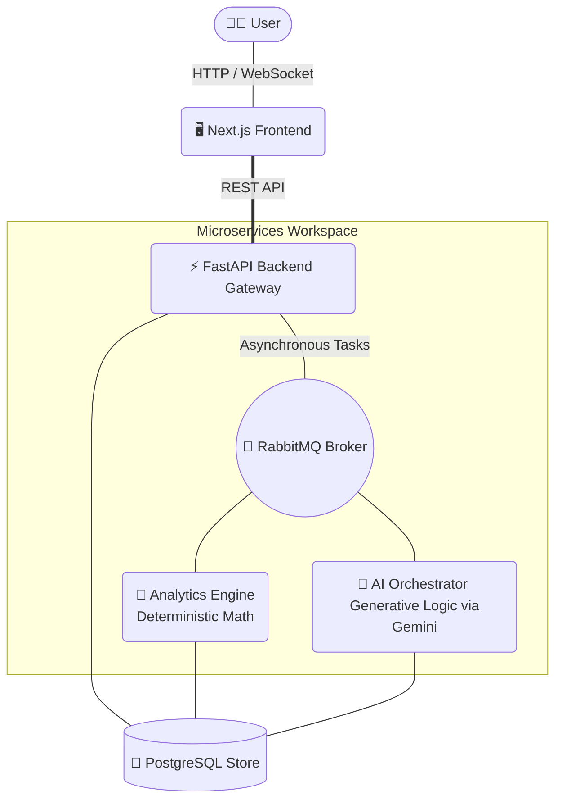

<div align="center">
  
  
  
  
  
  
  
  <br />
  <h1>🚀 AI Financial Analyst Platform</h1>
  <p>An enterprise-grade, microservice-based AI platform providing predictive analytics, real-time market data, and automated financial insights.</p>
</div>

<br />

## 🌟 Executive Summary

This platform is a comprehensive **AI Financial Analyst** designed for scale and resilience. Utilizing a microservices architecture bridged by RabbitMQ and powered by advanced **Gemini AI** capabilities, the system ingests, processes, and generates deep financial intelligence. The seamless, fluid frontend is built with **Next.js 16**, ensuring a world-class enterprise user experience.

---

## 🏗️ Architecture

The system is decoupled into specialized microservices, facilitating independent scaling and robust fault tolerance.



---

## ✨ Key Capabilities

🚀 **Microservices Architecture:** Independently scalable components (Gateway, Analytics, AI Orchestrator) communicating asynchronously via RabbitMQ.  
📈 **Real-Time Data Streams:** Live market quotes and continuous updates via WebSockets.  
🧠 **Generative AI & RAG:** Multi-agent collaboration (Detective, Forecaster, Advisor, Risk) employing Retrieval-Augmented Generation for deep document intelligence.  
🔐 **Enterprise Security:** Stateless JWT authentication, role-based access, and API rate limiting.  
📊 **Deterministic Analytics:** High-performance risk calculation engines for Value at Risk (VaR), Sharpe Ratio, and portfolio scoring.  
🐳 **Fully Containerized:** Deployment-ready with Docker and `docker-compose`.

---

## 🛠️ Technology Stack

| Layer | Technology | Purpose |
| :--- | :--- | :--- |
| **Frontend** | React 19, Next.js 16, TailwindCSS | Highly responsive, enterprise-grade UI |
| **API Gateway** | Python, FastAPI | High-concurrency routing and state management |
| **AI Orchestrator** | Google Gemini API, LangChain | Advanced reasoning and NLP extraction |
| **Analytics Engine** | Python, Pandas, NumPy | Heavy parallel computation of risk metrics |
| **Message Broker**| RabbitMQ | Asynchronous task queueing and decoupling |
| **Database** | PostgreSQL 13 | Durable, acid-compliant data persistence |

---

## 🚀 Getting Started

Launch the entire ecosystem locally with zero configuration friction.

### Prerequisites

- [Docker](https://www.docker.com/products/docker-desktop) & Docker Compose installed.
- API Key from Google (Gemini AI).

### Quick Setup

1. **Clone the repository & Navigate to project**
   ```bash
   git clone <your-repository-url>
   cd financial_analyst
   ```

2. **Configure Environment**
   Create a `.env` file in the root based on `.env.example`:
   ```env
   GEMINI_API_KEY=your_gemini_api_key_here
   SECRET_KEY=your_secure_jwt_secret
   ```

3. **Deploy the Cluster**
   ```bash
   docker-compose up --build -d
   ```

4. **Access the Application**
   - **Frontend UI:** [http://localhost:3000](http://localhost:3000)
   - **API Swagger Docs:** [http://localhost:8000/docs](http://localhost:8000/docs)
   - **RabbitMQ Dashboard:** [http://localhost:15672](http://localhost:15672) *(guest/guest)*

---

## 📈 System Monitoring

To ensure robust observability in a production-like environment, critical services emit structured logs. 
Monitor real-time task ingestion rates and AI token latency directly through the **RabbitMQ Management Portal** and Docker standard outputs.

## 📄 License

This project is licensed under the MIT License.
